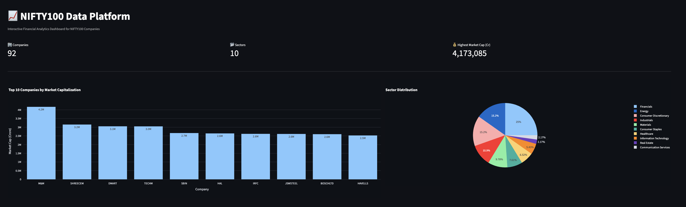
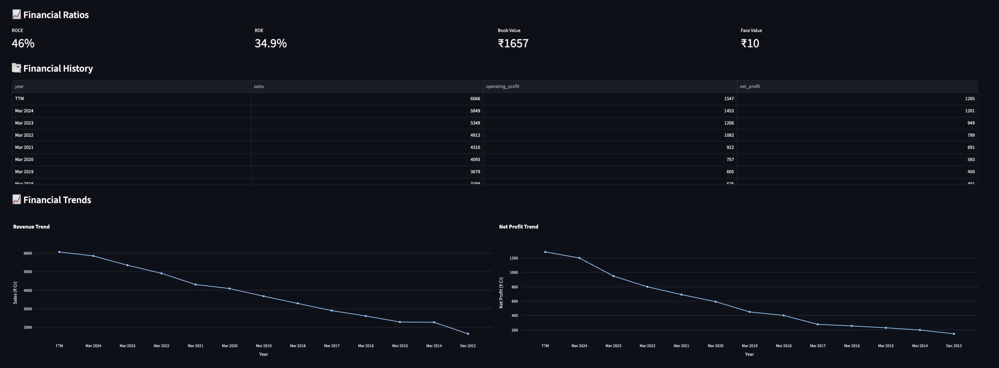

# 📈 NIFTY100 Data Platform

An end-to-end **Financial Data Engineering & Analytics Platform** built using **Python, Pandas, SQLite, SQL, Plotly, and Streamlit**. The project demonstrates the complete data lifecycle—from raw Excel datasets through ETL and data validation to SQL analytics and an interactive dashboard for exploring NIFTY100 company financial data.

---

## 🚀 Project Overview

The NIFTY100 Data Platform is designed to process, validate, store, analyze, and visualize financial data of NIFTY100 companies.

The project follows a production-inspired data engineering workflow:

```
Raw Excel Data
        │
        ▼
 ETL Pipeline
        │
        ▼
 Data Validation
        │
        ▼
 SQLite Database
        │
        ▼
 SQL Analytics
        │
        ▼
 Streamlit Dashboard
```

This project demonstrates practical skills in:

- Data Engineering
- ETL Pipeline Development
- Data Validation
- SQL Analytics
- Dashboard Development
- Financial Data Analysis
- Python Project Structuring

---

# ✨ Features

## 📥 Data Engineering

- Multi-file Excel ingestion
- Automated ETL pipeline
- Data normalization
- SQLite database loading
- Audit report generation

---

## ✅ Data Validation

The validation engine automatically performs:

- Missing value detection
- Duplicate row detection
- Empty column detection
- Invalid year validation
- Negative numeric value detection
- Primary key validation
- Foreign key validation
- Stock price validation
- Positive sales validation

---

## 🗄 Database

- SQLite relational database
- Automated schema creation
- Foreign key relationships
- Centralized financial data storage

---

## 📊 SQL Analytics

Generate analytical reports including:

- Top Companies by Market Capitalization
- Sector Distribution
- Financial Performance Analysis
- Profit Analysis
- Stock Price Analytics
- Company Financial Summary

---

## 📈 Interactive Dashboard

The Streamlit dashboard provides:

### KPI Dashboard

- Total Companies
- Total Sectors
- Highest Market Capitalization

### Interactive Visualizations

- Top 10 Companies by Market Capitalization
- Sector Distribution (Pie Chart)
- Revenue Trend
- Net Profit Trend
- Stock Price Trend

### Company Explorer

Select any company to view:

- Latest Financial Snapshot
- Company Profile
- Financial Ratios
- Historical Financial Data
- Revenue Trend
- Profit Trend
- Stock Price Analysis

---

# 🏗 Project Structure

```text
NIFTY100-DATA-PLATFORM/
│
├── config/
│
├── dashboard/
│   ├── app.py
│   ├── charts.py
│   ├── components.py
│   ├── database.py
│   ├── queries.py
│   └── assets/
│
├── data/
│   ├── raw/
│   ├── processed/
│   └── output/
│
├── db/
│   ├── nifty100.db
│   └── schema.sql
│
├── docs/
├── logs/
├── notebooks/
├── reports/
├── sql/
│
├── src/
│   ├── analytics/
│   ├── etl/
│   ├── utils/
│   └── validation/
│
├── tests/
│
├── README.md
├── requirements.txt
├── Makefile
└── .gitignore
```

---

# 📂 Datasets

The platform processes financial datasets including:

- Companies
- Balance Sheet
- Profit & Loss
- Cash Flow
- Financial Ratios
- Market Capitalization
- Historical Stock Prices
- Documents
- Company Analysis
- Pros & Cons
- Sectors
- Peer Groups

---

# ⚙️ ETL Workflow

```text
Excel Files
      │
      ▼
Excel Loader
      │
      ▼
Data Cleaning
      │
      ▼
Validation Engine
      │
      ▼
Validation Reports
      │
      ▼
SQLite Schema
      │
      ▼
Database Loader
      │
      ▼
Analytics Ready Database
      │
      ▼
Interactive Dashboard
```

---

# 📋 Output Files

The pipeline generates:

```text
data/output/load_audit.csv
data/output/validation_failures.csv
db/nifty100.db
reports/*.csv
```

---

# 🛠 Tech Stack

### Programming

- Python

### Data Processing

- Pandas
- NumPy

### Database

- SQLite
- SQL

### Dashboard

- Streamlit
- Plotly

### Development Tools

- VS Code
- Git
- GitHub

---

# 🚀 Installation

## Clone the repository

```bash
git clone https://github.com/Aq03-svg/NIFTY100-DATA-PLATFORM.git
```

## Move into the project

```bash
cd NIFTY100-DATA-PLATFORM
```

## Install dependencies

```bash
pip install -r requirements.txt
```

## Run the dashboard

```bash
streamlit run dashboard/app.py
```

---

# 📸 Dashboard Preview

> Add screenshots here after uploading them to the repository.

Example:

```
reports/
└── screenshots/
    ├── dashboard_home.png
    ├── company_profile.png
    ├── financial_trends.png
```

Then display them like:

```markdown
## Dashboard



## Company Explorer


## Financial Trends


```

---

# 🎯 Learning Outcomes

This project demonstrates hands-on experience with:

- ETL Pipeline Development
- Data Cleaning & Validation
- SQL Database Design
- SQLite Integration
- Financial Data Analytics
- SQL Query Development
- Interactive Dashboard Development
- Data Visualization
- Modular Python Project Architecture
- Git & GitHub Version Control

---

# 🔮 Future Enhancements

- Live NSE/BSE API integration
- Scheduled ETL automation
- Docker containerization
- Cloud deployment (AWS/Azure/GCP)
- User authentication
- Portfolio optimization analytics
- Mutual Fund comparison module
- Predictive analytics using Machine Learning

---

# 👨‍💻 Author

## **Aqeeb Javeed Shaikh**

AI & Machine Learning Undergraduate

Aspiring Data Scientist | Machine Learning Engineer

GitHub: https://github.com/Aq03-svg

---

## ⭐ If you found this project useful, consider giving it a star on GitHub!